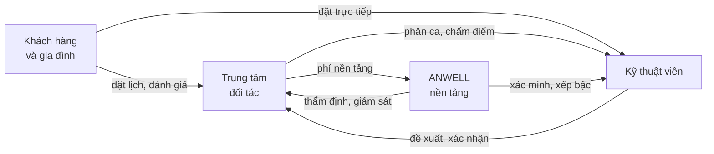

# Tổng quan sản phẩm ANWELL

> Tài liệu này mô tả **mô hình và chức năng** đã dựng trong bản demo.
> Mọi con số trong demo là **dữ liệu giả lập để minh hoạ**, không phải kết quả
> kinh doanh. Đừng trích số từ demo ra làm số liệu thật.

## 1. Vấn đề

Khi một người xuất viện sau đột quỵ hay sau mổ khớp, việc phục hồi mới bắt đầu —
và phần lớn gánh nặng rơi vào gia đình. Người nhà được giao tập vận động nhiều
lần mỗi ngày, kéo dài hàng tháng, mà không được đào tạo để làm những việc đó.

Cùng một mẫu vấn đề lặp lại ở người cao tuổi suy yếu dần và phụ nữ sau sinh: nhu
cầu có thật, liệu trình dài, nhưng không có ai theo sát.

Ở phía cung, kỹ thuật viên trị liệu giỏi thì phân tán — người làm công ăn lương
ở trung tâm, người nhận khách lẻ qua mạng xã hội. Không có nơi nào chuẩn hoá tay
nghề, theo dõi chất lượng và kết nối họ với người thật sự cần.

## 2. Bốn vai trò trong hệ sinh thái

| Vai trò | Làm gì |
|---|---|
| **Khách hàng** | Chọn cơ sở hoặc KTV tại nhà, theo dõi tiến triển, đánh giá, tích điểm |
| **Trung tâm** | Điều phối ca, quản lý KTV và khách, đối soát doanh thu, giữ chất lượng |
| **Kỹ thuật viên** | Nhận ca từ trung tâm, hoặc tự nhận khách riêng; ghi chép buổi làm việc |
| **ANWELL** | Thẩm định trung tâm, xác minh và xếp bậc KTV, đặt chính sách, giám sát chất lượng |

## 3. Mô hình hai lớp — điểm cốt lõi

Đây là điều làm ANWELL khác một sàn đặt lịch thông thường. Một kỹ thuật viên có
thể đồng thời có **hai quan hệ lao động**:

| | Làm tại trung tâm | Làm tự do |
|---|---|---|
| Đối tác | Trung tâm (ví dụ An Nhiên Wellness) | ANWELL |
| Ai giao việc | Trung tâm phân ca | KTV tự nhận yêu cầu |
| Ai đánh giá | Trung tâm chấm theo quy trình | Khách chấm sau mỗi buổi |
| Vai trò của KTV | Người làm công | Người tự kinh doanh |
| Dòng tiền | Lương theo ca | Doanh thu trừ phí nền tảng |
| Cơ chế kiểm soát | **Cửa phê duyệt** — đổi giờ, huỷ ca đều phải trung tâm duyệt | **Hậu quả thị trường** — huỷ ca ảnh hưởng thứ hạng hiển thị |

Nguyên tắc nền tảng, trích từ giao diện quản trị:

> *ANWELL trực tiếp quản lý KTV khi họ làm tự do. KTV đang làm tại trung tâm do
> trung tâm điều phối và chấm điểm.*

Mô hình này được ANWELL cho phép nhưng **có ràng buộc** — trung tâm giữ quan hệ
thương mại với khách của mình, KTV chỉ thấy nội dung chuyên môn cần để làm việc.

### Ràng buộc cụ thể: KTV thấy gì về khách của trung tâm

| KTV **thấy** | KTV **không thấy** |
|---|---|
| Tên khách dạng rút gọn | Số điện thoại, địa chỉ nhà |
| Liệu trình và tiến triển | Giá dịch vụ, khách trả bao nhiêu |
| Ghi chú chuyên môn các buổi trước | Hồ sơ đầy đủ, lịch sử với KTV khác |
| Lưu ý sức khoẻ, dặn dò từ gia đình | Nút đặt lại lịch, nhắn trực tiếp |

Lý do: KTV **cần** thông tin chuyên môn để làm việc an toàn và đúng liệu trình —
giấu đi thì buổi trị liệu kém chất lượng. Nhưng thông tin thương mại và liên hệ
là tài sản của trung tâm.

## 4. Bốn giao diện đã dựng

### 4.1 Khách hàng — 20 màn hình

Khám phá cơ sở · trang chi tiết cơ sở · đặt lịch · chọn KTV tại nhà · buổi làm
việc · đánh giá · Hành trình An · hạng thưởng · ví · nhóm gia đình · gói chăm
sóc · đặt gói · nhắn tin với KTV · giới thiệu bạn · nhắc lịch · báo cáo tiến
triển · thực đơn gợi ý · chính sách · xác minh · giới thiệu lần đầu.

Ba phong cách hiển thị (An Nhiên · Rừng Thẫm · Nhịp Sen) để khách tự chọn, song
ngữ Việt/Anh.

### 4.2 Kỹ thuật viên — 5 mục, hai chế độ

Năm mục dùng chung tên ở cả hai chế độ, chỉ đổi nội dung theo đối tác:

| Mục | Tại trung tâm | Làm tự do |
|---|---|---|
| **Tổng quan** | Ca hôm nay do trung tâm phân, điểm kế tiếp nếu có ca ngoài cơ sở | Trạng thái nhận khách, yêu cầu mới |
| **Lịch làm** | Ba tab: Danh sách · Bản đồ · Khả dụng | Như bên trái |
| **Khách hàng** | Khách đang phụ trách, chỉ nội dung chuyên môn | CRM khách riêng đầy đủ |
| **Tài chính** | Lương từ trung tâm, kỳ đối soát | Doanh thu sau phí nền tảng, khách nợ |
| **Tôi** | Giống hệt nhau — hồ sơ là của một người | Như bên trái |

Điểm đáng chú ý ở tab **Khả dụng**, chế độ tại trung tâm — luồng điều phối hai
chiều có phê duyệt:

- Trung tâm phân công → KTV xác nhận
- KTV đề xuất → trung tâm xác nhận
- Đổi lịch, hoãn lịch → phải được duyệt, bắt buộc kèm lý do
- Ốm đau và bất khả kháng → **có hiệu lực ngay**, không chờ duyệt, nhưng có đếm
  số lần vì ảnh hưởng chỉ số tuân thủ quy trình

Mục **Tôi** giống nhau tuyệt đối ở hai chế độ, chứa cả hai nguồn đánh giá (trung
tâm chấm và khách chấm), hồ sơ, chứng chỉ, thông tin liên hệ, cấu hình hiển thị
và khai báo thuế cá nhân.

### 4.3 Trung tâm — 11 trang

**Vận hành:** Tổng quan hôm nay · Điều phối lịch · Yêu cầu từ khách · Yêu cầu từ
KTV · Kỹ thuật viên
**Kinh doanh:** Khách hàng · Dịch vụ & bảng giá · Doanh thu & đối soát
**Chất lượng:** Đánh giá & chất lượng · Vật tư & thiết bị
**Hệ thống:** Cấu hình trung tâm

Hai trang xử lý yêu cầu là phía đối ứng của những gì khách và KTV gửi lên. Trang
Cấu hình có khai báo thuế doanh nghiệp và tuỳ chọn khấu trừ hộ KTV.

### 4.4 Quản trị nền tảng — 8 trang

**Tổng quan:** Bảng điều hành
**Đối tượng:** Quản lý trung tâm · Phê duyệt hồ sơ · KTV tự do
**Khách hàng:** Loyalty ANP · Đối tác liên kết
**Nền tảng:** Chính sách & cấu hình · Dữ liệu & AI

Trang **Phê duyệt hồ sơ** có một quy tắc đáng chú ý: hồ sơ thiếu giấy tờ bắt
buộc thì **không phê duyệt thẳng được** — nút phê duyệt bị vô hiệu và hệ thống
chuyển hành động chính sang "Yêu cầu bổ sung". Duyệt một cơ sở trị liệu chưa có
PCCC hay chứng nhận vệ sinh là rủi ro pháp lý và an toàn cho khách.

## 5. Cơ chế doanh thu và thuế

- Trung tâm trả **phí nền tảng theo tỷ lệ chiết khấu** trên doanh thu, có hoá
  đơn GTGT
- KTV làm tự do chịu phí nền tảng trên ca tự do; ca do trung tâm phân thì nhận
  lương từ trung tâm
- KTV chọn một trong hai hình thức nộp thuế:
  - **Uỷ quyền khấu trừ tại nguồn** — trung tâm và ANWELL khấu trừ trước khi trả
  - **Tự kê khai theo diện hộ kinh doanh** — nhận đủ tiền, tự nộp
- Trung tâm khai phương pháp tính GTGT, kỳ kê khai, hoá đơn điện tử, và bật/tắt
  khấu trừ hộ cho KTV đã uỷ quyền

> Mức thuế, ngưỡng chịu thuế và kỳ kê khai thay đổi theo quy định từng thời kỳ.
> Phần này trong demo chỉ minh hoạ luồng khai báo; bản chạy thật cần kế toán rà
> soát.

## 6. Chương trình khách hàng — Hành trình An

Hạng thành viên theo điểm ANP, tích luỹ qua các buổi trị liệu. Nền tảng vận hành
song song hai lớp điểm: **hạng ANP toàn nền tảng** và **điểm riêng của từng
trung tâm** — trung tâm được giữ chương trình riêng nhưng trong khuôn khổ chính
sách chung.
