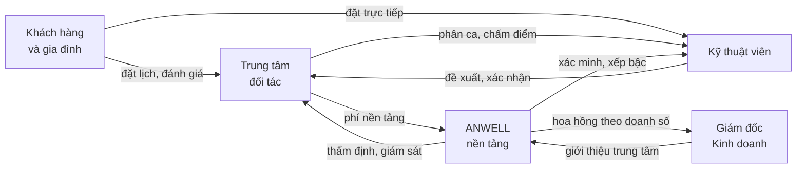

# Tổng quan sản phẩm ANWELL

> Tài liệu này mô tả **mô hình và chức năng** đã dựng trong bản demo.
> Mọi con số trong demo là **dữ liệu giả lập để minh hoạ**, không phải kết quả
> kinh doanh. Đừng trích số từ demo ra làm số liệu thật.

## 1. Vấn đề

Khi một người xuất viện sau đột quỵ hay sau mổ khớp, việc phục hồi mới bắt đầu —
và phần lớn gánh nặng rơi vào gia đình. Người nhà được giao tập vận động nhiều
lần mỗi ngày, kéo dài hàng tháng, mà không được đào tạo để làm những việc đó.

Cùng một mẫu vấn đề lặp lại ở người cao tuổi suy yếu dần và phụ nữ sau sinh: nhu
cầu có thật, liệu trình dài, nhưng không có ai theo sát.

Ở phía cung, kỹ thuật viên trị liệu giỏi thì phân tán — người làm công ăn lương
ở trung tâm, người nhận khách lẻ qua mạng xã hội. Không có nơi nào chuẩn hoá tay
nghề, theo dõi chất lượng và kết nối họ với người thật sự cần.

## 2. Năm vai trò trong hệ sinh thái



| Vai trò | Làm gì |
|---|---|
| **Khách hàng** | Chọn cơ sở hoặc KTV tại nhà, theo dõi tiến triển, đánh giá, tích điểm |
| **Trung tâm** | Điều phối ca, quản lý KTV và khách, đối soát doanh thu, giữ chất lượng |
| **Kỹ thuật viên** | Nhận ca từ trung tâm, hoặc tự nhận khách riêng; ghi chép buổi làm việc |
| **ANWELL** | Thẩm định trung tâm, xác minh và xếp bậc KTV, đặt chính sách, giám sát chất lượng |
| **Giám đốc Kinh doanh** | Đưa trung tâm mới về nền tảng; hưởng % doanh số của chính những nơi mình giới thiệu, sau khi ANWELL duyệt |

## 3. Mô hình hai lớp — điểm cốt lõi

Đây là điều làm ANWELL khác một sàn đặt lịch thông thường. Một kỹ thuật viên có
thể đồng thời có **hai quan hệ lao động**:

| | Làm tại trung tâm | Làm tự do |
|---|---|---|
| Đối tác | Trung tâm (ví dụ An Nhiên Wellness) | ANWELL |
| Ai giao việc | Trung tâm phân ca | KTV tự nhận yêu cầu |
| Ai đánh giá | Trung tâm chấm theo quy trình | Khách chấm sau mỗi buổi |
| Vai trò của KTV | Người làm công | Người tự kinh doanh |
| Dòng tiền | Lương theo ca | Doanh thu trừ phí nền tảng |
| Cơ chế kiểm soát | **Cửa phê duyệt** — đổi giờ, huỷ ca đều phải trung tâm duyệt | **Hậu quả thị trường** — huỷ ca ảnh hưởng thứ hạng hiển thị |

Nguyên tắc nền tảng, trích từ giao diện quản trị:

> *ANWELL trực tiếp quản lý KTV khi họ làm tự do. KTV đang làm tại trung tâm do
> trung tâm điều phối và chấm điểm.*

Mô hình này được ANWELL cho phép nhưng **có ràng buộc** — trung tâm giữ quan hệ
thương mại với khách của mình, KTV chỉ thấy nội dung chuyên môn cần để làm việc.

### Ràng buộc cụ thể: ba nhóm khách, ba mức quyền

Không phải hai nhóm mà ba, và chúng khác nhau ở **quyền** chứ không chỉ ở nhãn:

| | Khách tại trung tâm | Khách tại nhà · TT phân công | Khách riêng của KTV |
|---|---|---|---|
| Hồ sơ sức khoẻ | Xem trong ca | Xem trong ca | Xem đầy đủ |
| Số điện thoại | Che, gọi qua tổng đài | Che, gọi qua tổng đài | Hiện, gọi thẳng |
| Địa chỉ | Không cần | **Chỉ mở vào ngày có ca** | Xem đầy đủ |
| Nhắn tin | Qua trung tâm | Qua trung tâm | Trực tiếp |
| Đổi/huỷ lịch | TT duyệt | TT duyệt | KTV tự quyết |
| Giá | TT đặt | TT đặt | KTV đặt |
| Tiền về | Qua trung tâm | Qua trung tâm | Khách trả thẳng, nền tảng thu phí |
| **Khi KTV rời TT** | Mất quyền xem | Mất quyền xem | Giữ nguyên |

Số điện thoại hiển thị dạng `0903 ••• ••12` — đủ để KTV nhận ra đúng người khi
trung tâm nhắc, không đủ để gọi thẳng. Cuộc gọi đi qua tổng đài ANWELL che số.

Lý do: KTV **cần** thông tin chuyên môn để làm việc an toàn và đúng liệu trình —
giấu đi thì buổi trị liệu kém chất lượng. Nhưng thông tin thương mại và liên hệ
là tài sản của trung tâm.

Dòng cuối bảng được **nói thẳng trong app** ở màn Khách hàng, không để KTV tự
đoán: thôi liên kết là mất toàn bộ khách được giao, khách tự tìm thì giữ nguyên.
Nói trước để KTV tính đường dài, và để trung tâm yên tâm giao khách.

## 4. Sáu trang đã dựng

Bốn giao diện sản phẩm, cộng trang giới thiệu công khai và trang gom demo:

| Trang | Là gì |
|---|---|
| `index.html` | **ANWELL Portal** — trang giới thiệu công khai, mặt tiền |
| `demo.html` | Trang gom các cổng, tiện khi ngồi demo trực tiếp |
| `app.html` · `center.html` · `ktv.html` · `bd.html` · `admin.html` | Năm giao diện sản phẩm |

**Cổng Giám đốc Kinh doanh đã có bản riêng** tại `bd.html`. Tab *Xem trước màn
GĐKD* trong `admin.html` vẫn giữ để người quản trị nền tảng xem nhanh.

### 4.1 Khách hàng — 5 mục ở thanh đáy

| Mục | Nội dung |
|---|---|
| **Đặt lịch** | Mở app là vào thẳng đây. Hình thức · đặt cho ai · loại hình · phục hồi · phương pháp · khu vực · khung giờ · ưu đãi |
| **Lịch hẹn** | Lịch sắp tới, quản lý lịch (đổi/hoãn/huỷ), nhắn tin với KTV, nhắc buổi hẹn |
| **Khám phá** | Chỉ icon, ở giữa. Cơ sở, kỹ thuật viên, nội dung dưỡng sinh |
| **Tiến triển** | Lịch chăm sóc người thân nổi lên đầu nếu có, bài tập tại nhà, báo cáo, nhóm gia đình, nhắc bài tập |
| **Tôi** | Thanh tiến độ hồ sơ, hạng thành viên, hồ sơ sức khoẻ, ví & gói, phong cách giao diện |

Các màn phụ: buổi làm việc (ba giai đoạn) · đánh giá · giới thiệu bạn · chính
sách · chứng nhận KTV · thực đơn gợi ý · xác minh · làm quen sau đăng ký.

Mọi màn phụ đều có nút `<` trả về **màn trước đó**, không phải một tab cố định.

Ba phong cách hiển thị (An Nhiên · Rừng Thẫm · Nhịp Sen) để khách tự chọn, song
ngữ Việt/Anh.

**Hồ sơ sức khoẻ** là thứ đáng chú ý nhất: khách khai tình trạng một lần, hệ
thống tự cảnh báo dịch vụ cần tránh ngay lúc đặt lịch, và KTV đọc lại đúng cảnh
báo đó ở thẻ chuẩn bị trước ca.

### 4.2 Kỹ thuật viên — 5 mục, hai chế độ

Năm mục dùng chung tên ở cả hai chế độ, chỉ đổi nội dung theo đối tác:

| Mục | Tại trung tâm | Làm tự do |
|---|---|---|
| **Tổng quan** | Ca hôm nay do trung tâm phân, điểm kế tiếp nếu có ca ngoài cơ sở | Trạng thái nhận khách, yêu cầu mới |
| **Lịch làm** | Ba tab: Danh sách · Bản đồ · Khả dụng | Như bên trái |
| **Khách hàng** | Khách đang phụ trách, chỉ nội dung chuyên môn | CRM khách riêng đầy đủ |
| **Tài chính** | Lương từ trung tâm, kỳ đối soát | Doanh thu sau phí nền tảng, khách nợ |
| **Tôi** | Giống hệt nhau — hồ sơ là của một người | Như bên trái |

Điểm đáng chú ý ở tab **Khả dụng**, chế độ tại trung tâm — luồng điều phối hai
chiều có phê duyệt:

- Trung tâm phân công → KTV xác nhận
- KTV đề xuất → trung tâm xác nhận
- Đổi lịch, hoãn lịch → phải được duyệt, bắt buộc kèm lý do
- Ốm đau và bất khả kháng → **có hiệu lực ngay**, không chờ duyệt, nhưng có đếm
  số lần vì ảnh hưởng chỉ số tuân thủ quy trình

Mục **Tôi** giống nhau tuyệt đối ở hai chế độ, chứa cả hai nguồn đánh giá (trung
tâm chấm và khách chấm), hồ sơ, chứng chỉ, thông tin liên hệ, cấu hình hiển thị
và khai báo thuế cá nhân.

#### Màn Buổi làm việc — nơi KTV ở suốt ca

Ba giai đoạn, và phần lớn công cụ nằm ở đây chứ không rải ra menu:

| Giai đoạn | Có gì |
|---|---|
| **Chờ** | Thẻ chuẩn bị: điều cần tránh theo hồ sơ khách × dịch vụ của ca, buổi trước làm gì, gia đình dặn gì, ghi chú KTV ca trước để lại. Ai đang theo dõi buổi. **Ô nhập mã xác minh** — gõ đúng bốn số khách đọc mới check-in được |
| **Đang chạy** | Tick nội dung đã làm · đề xuất đổi/thêm dịch vụ · chia sẻ vị trí trực tiếp · ghi chú · **Báo sự cố** và **SOS** (hai nút tách hẳn nhau) |
| **Xong** | Trạng thái khách xác nhận giờ, đường xử lý khi khách báo sai lệch · giao bài tập về nhà · ghi lại cho KTV ca sau |

Ba chỗ tách bạc rõ ràng, và đây là chủ ý thiết kế chứ không phải ngẫu nhiên:

- **SOS ≠ Báo sự cố.** SOS là "tôi thấy không an toàn" — gọi ngay, không hỏi
  lại. Báo sự cố là "ca gặp trục trặc nhưng tôi vẫn ổn". Gộp chung thì KTV ngại
  bấm SOS vì sợ làm to chuyện, đúng lúc cần bấm nhất.
- **Chia sẻ vị trí ≠ SOS.** Bật từ đầu ca, chạy nền, điều phối viên thấy. SOS là
  lúc đã muộn; đây là phòng ngừa.
- **Ghi chú về khách ≠ chấm sao.** Khách không xem được, nên KTV dám ghi thật.
  Nhãn chỉ ghi việc đã xảy ra ("Hay đổi giờ phút chót", "Nhà có bậc thang hẹp"),
  không có "khó tính" hay "dễ chịu" — số sao thì vô nghĩa, lý do mới dùng được.
  Nó hiện lại ở thẻ chuẩn bị của người nhận ca sau, kèm tên và ngày.

Mọi màn phụ đều có nút `<` trả về màn trước đó, giống app khách.

### 4.3 Trung tâm — 14 trang / 5 nhóm

| Nhóm | Trang | Tab bên trong |
|---|---|---|
| **Hôm nay** | Tổng quan | — |
| | Quầy lễ tân | Đang diễn ra · Khách đến hôm nay · Đặt lịch hộ · Danh sách chờ |
| | Lịch hẹn | Theo kỹ thuật viên · Theo phòng · Nguồn đặt |
| | Cần duyệt | Từ khách · Từ kỹ thuật viên |
| **Khách hàng** | Hồ sơ khách | bảng → mở hồ sơ chi tiết |
| | Liệu trình & gói | Gói đang bán · Khách đang dùng · Sắp hết buổi |
| | Chăm sóc & ưu đãi | Chiến dịch · ZNS/SMS · Tự động |
| | Đánh giá & phản hồi | — |
| **Nhân sự** | Kỹ thuật viên | Đang làm · Đăng ký mới · Chứng chỉ sắp hết |
| | Lương & hoa hồng | Kỳ này · Cách tính *(chỉ đọc)* |
| **Kinh doanh** | Dịch vụ & bảng giá | Bảng giá & gói · Lương khoán KTV · Định mức vật tư |
| | Phòng & vật tư | Phòng · Thiết bị & bảo trì · Kho vật tư |
| | Doanh thu & đối soát | Doanh thu · Kết quả theo dịch vụ · Đối soát nền tảng |
| **Hệ thống** | Cấu hình trung tâm | Chung · Vai trò & quyền · Nhật ký thao tác |

Nhóm đầu tên là **"Hôm nay"** chứ không phải "Vận hành": bốn mục đó là thứ người
ta mở mỗi sáng. Mục nào chẳng là vận hành, tên đó không phân biệt gì.

#### Bốn chỗ đáng chú ý

**Quầy lễ tân** vá ba lỗ hằng ngày: đặt lịch hộ khách gọi điện, đánh dấu khách
đến và vắng mặt, bảng phòng đang chạy ngay lúc này. Trước đây tab *Nguồn đặt* ghi
212 buổi lễ tân đặt hộ mà không có màn nào để đặt.

**Cần duyệt** gộp ba loại việc khác bản chất, huy hiệu ở menu đếm cả ba:

1. **Duyệt lịch** — đổi giờ, huỷ ca, xin thêm việc. Câu hỏi là cho hay không cho.
2. **Sự cố tại ca** — việc đã xảy ra rồi. Câu hỏi là *ai chịu phí*. Nhãn nút viết
   thẳng hệ quả tiền bạc: "Tính công KTV · thu 50% phí khách" thay vì "Duyệt".
3. **Phân xử giờ** — bản ghi định vị check-in/check-out đặt lên trước, ghi rõ
   *bên thứ ba · không ai sửa được*. Có đường thứ ba là chia đôi.

**Ba quy định tách rời nhau**, không trộn chung một bảng:

| Quy định về | Ở đâu |
|---|---|
| Giá với **khách** | Dịch vụ & bảng giá → Bảng giá & gói |
| Trả với **kỹ thuật viên** | Dịch vụ & bảng giá → Lương khoán KTV |
| **Kết quả** ra sao | Doanh thu → Kết quả theo dịch vụ |

Lương khoán là **tỷ lệ 30–45% trên giá niêm yết sau thuế, chưa trừ ưu đãi** —
nghĩa là trung tâm chịu trọn phần giảm giá, kỹ thuật viên không mất thu nhập vì
khuyến mãi mà họ không quyết định. Nền tảng chặn cứng hai đầu 30% và 45%. Chỉ
**Giám đốc** sửa được, lấy quyền từ ô *"Đặt giá dịch vụ và lương khoán"* trong ma
trận ở Cấu hình → Vai trò & quyền.

**Vai trò & quyền** là ma trận 13 đầu việc × 5 vai trò, mỗi ô bật tắt riêng. Chia
theo trách nhiệm công việc chứ không theo chức danh, và vai trò không cố định.

### 4.4 Quản trị nền tảng — 14 trang / 5 nhóm

| Nhóm | Trang | Tab bên trong |
|---|---|---|
| **Điều hành** | Bảng điều hành | — |
| | Cần xử lý | Duyệt hồ sơ · Khiếu nại leo thang · Sự cố an toàn |
| **Thành viên** | Trung tâm | Đang hoạt động · Hồ sơ đăng ký · Tạm dừng & chấm dứt |
| | Kỹ thuật viên | KTV tự do · Hồ sơ đăng ký · Bậc & chứng chỉ |
| | Khách hàng | Tài khoản · Quyền dữ liệu cá nhân |
| | Giám đốc Kinh doanh | Danh sách · Trung tâm đã giới thiệu · Chính sách hoa hồng · Màn GĐKD nhìn thấy<br>Cổng riêng của họ ở `bd.html` |
| **Kinh doanh** | Gói nền tảng & tiện ích | Gói nền tảng · Tiện ích gia tăng · Ai đang dùng |
| | Doanh thu & đối soát | Doanh thu · Đối soát trung tâm · Công nợ |
| | Loyalty ANP | — |
| **Truyền thông** | Social media | Kênh · Chiến dịch · Nội dung chờ duyệt |
| | Đối tác liên kết | — |
| **Hệ thống** | Danh mục chuẩn | Dịch vụ · Chứng chỉ & bậc · Thiết bị & hãng · Sức khoẻ & chống chỉ định |
| | Chính sách & thông số | — |
| | Dữ liệu, AI & nhật ký | Mô hình · Quản trị dữ liệu · Nhật ký thao tác |

#### Vòng đời thành viên — sáu trạng thái

```
Nháp → Chờ thẩm định → [Yêu cầu bổ sung] → Đã duyệt → Tạm dừng → Chấm dứt
                            ↑______________|              ↓
                                                      khôi phục
```

**Tạm dừng khác chấm dứt**, và sản phẩm nói rõ nghĩa vụ còn lại: tạm dừng thì
không nhận khách mới nhưng **lịch đã đặt vẫn phải phục vụ**; chấm dứt thì phải xử
lý xong gói khách đã mua chưa dùng hết.

#### Hồ sơ đăng ký — hai biểu mẫu

**Trung tâm** khai bốn nhóm: thông tin cơ bản (gồm fanpage, YouTube, TikTok) ·
hoạt động (số KTV, ai có chứng chỉ gì) · dịch vụ và phương pháp (cổ truyền hay
thiết bị, ghi rõ hãng) · pháp lý. Kèm hai cam kết.

**Giấy phép hành nghề là điều kiện *có điều kiện*:** chỉ hiện và chỉ bắt buộc khi
hồ sơ khai có dịch vụ trị liệu, xâm lấn hoặc khám chữa bệnh. Thiếu giấy tờ bắt
buộc thì nút Phê duyệt bị khoá, hành động chính chuyển sang *Yêu cầu bổ sung*.

**Kỹ thuật viên tự do** khai họ tên · CCCD · địa chỉ · điện thoại · chứng chỉ còn
hiệu lực · số năm nghề · dịch vụ có thể làm · khám sức khoẻ, kèm hai cam kết. Số
CCCD chỉ ANWELL thấy đầy đủ; sau thẩm định, màn của trung tâm chỉ còn bốn số cuối.

**Bậc luôn do ANWELL cấp**, trung tâm không tự phong — bậc là thứ khách nhìn vào
để tin, mỗi nơi tự phong thì bậc mất nghĩa trên toàn mạng.

#### Danh mục chuẩn — một nguồn duy nhất

Bốn danh mục trước đây hard-code rải rác ở `app.html`, `ktv.html` và
`center.html`: loại hình dịch vụ · chứng chỉ & bậc · hãng thiết bị · tình trạng
sức khoẻ và chống chỉ định. Sửa một chỗ quên chỗ kia là ra mâu thuẫn ngay —
**bảng chống chỉ định từng có hai bản riêng và đã gây lỗi thật**: khách khai huyết
áp cao mà không dịch vụ nào cảnh báo.

Mỗi danh mục nhấp vào được, có giới thiệu, số nơi đang dùng, và ba thao tác
*Thêm · Tạm dừng · Xoá*. Xoá bị chặn khi còn nơi đang dùng.

#### Gói nền tảng — ba cho trung tâm, ba cho KTV

| | Trung tâm | KTV tự do |
|---|---|---|
| Gói cơ bản | miễn phí · chiết khấu 18% | miễn phí · chiết khấu 15% |
| Gói giữa | 1,5tr/tháng · 15% | 250k/tháng · 12% |
| Gói cao | 4,2tr/tháng · 12% | 600k/tháng · 9% |

Mỗi gói có nút *Điều chỉnh* sửa thuê bao và chiết khấu tại chỗ. Cộng năm tiện ích
bán thêm. Doanh thu ngoài chiết khấu chiếm 25% — đó là lập luận khi trung tâm lớn
đòi giảm phần trăm.

#### Giám đốc Kinh doanh

Hưởng % doanh số của chính những trung tâm mình giới thiệu, **sau khi ANWELL
duyệt**. Hồ sơ chờ và bị từ chối không tính đồng nào. Chế độ hưởng — có thời hạn
hay trọn đời — là **lựa chọn ADMIN đặt**, không ghi cứng: sau này Hội đồng quản
trị bỏ phiếu rồi chỉnh ở đúng chỗ đó.

## 5. Cơ chế doanh thu và thuế

- Trung tâm trả **phí nền tảng theo tỷ lệ chiết khấu** trên doanh thu, có hoá
  đơn GTGT
- KTV làm tự do chịu phí nền tảng trên ca tự do; ca do trung tâm phân thì nhận
  lương từ trung tâm
- KTV chọn một trong hai hình thức nộp thuế:
  - **Uỷ quyền khấu trừ tại nguồn** — trung tâm và ANWELL khấu trừ trước khi trả
  - **Tự kê khai theo diện hộ kinh doanh** — nhận đủ tiền, tự nộp
- Trung tâm khai phương pháp tính GTGT, kỳ kê khai, hoá đơn điện tử, và bật/tắt
  khấu trừ hộ cho KTV đã uỷ quyền

> Mức thuế, ngưỡng chịu thuế và kỳ kê khai thay đổi theo quy định từng thời kỳ.
> Phần này trong demo chỉ minh hoạ luồng khai báo; bản chạy thật cần kế toán rà
> soát.

## 6. Chương trình khách hàng — Hành trình An

Hạng thành viên theo điểm ANP, tích luỹ qua các buổi trị liệu. Nền tảng vận hành
song song hai lớp điểm: **hạng ANP toàn nền tảng** và **điểm riêng của từng
trung tâm** — trung tâm được giữ chương trình riêng nhưng trong khuôn khổ chính
sách chung.
